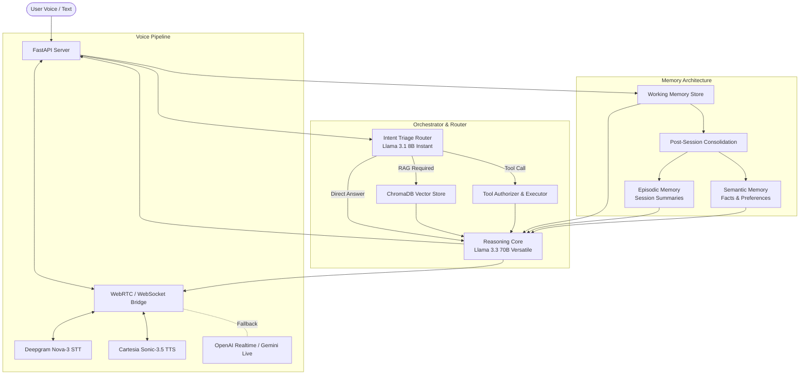

#  Chief of Agents - Voice-First Personal AI Agent

[](https://www.python.org/downloads/)
[](https://fastapi.tiangolo.com/)
[](https://www.trychroma.com/)
[](LICENSE)

A production-grade, voice-first personal AI assistant framework designed to demonstrate end-to-end multi-agent orchestration, multi-layer memory management, personal RAG retrieval, tool authorization, real-time duplex voice streaming, and system evals.

---

##  Architecture Overview

The system uses a **tiered model routing architecture** to balance low latency, high reasoning quality, and cost efficiency. Simple queries are handled directly or routed to fast triage models, while complex tasks trigger RAG context assembly, multi-step tool execution, or multi-layer memory updates.



---

##  Key Features

-  **Low-Latency Streaming Voice**: Real-time full-duplex speech-to-speech engine using Deepgram (STT) and Cartesia (TTS) over WebRTC and WebSockets, with built-in fallbacks for OpenAI GPT-4o Realtime API and Gemini Live API.
-  **Tiered Model Routing**: Lowers latency and token costs by routing incoming requests through a fast triage model (Llama 3.1 8B) before invoking heavy reasoning models (Llama 3.3 70B).
-  **Personal Knowledge RAG**: Ingests personal `.txt` and markdown documents into ChromaDB vector store for precise, zero-shot context retrieval.
-  **Multi-Layer Memory System**:
  - **Working Memory**: In-process or Redis session state.
  - **Episodic Memory**: Automatically generates post-session structured summaries.
  - **Semantic Memory**: Stores durable facts and user preferences.
  - **Procedural Memory**: Manages execution routines and tool workflows.
-  **Tool Authorization & Execution Engine**: Integrates external tools (SQLite Calendar management, Web search/browser automation) with safety authorization policies and pending approval state handling.
-  **Evals & Benchmark Suite**: Includes evaluation dataset (`tests/eval_dataset.json`) and automated runner (`scripts/run_evals.py`) to measure routing accuracy, retrieval precision@k, cost/token metrics, and response latency.
-  **Interactive Live Visualizer**: Custom frontend web dashboard (`visualizer/`) displaying real-time audio waveforms, active pipeline logs, tool invocation status, and system metrics.

---

##  Repository Structure

```text
Chief_of_agents/
├── app/
│   ├── config.py                 # System configuration & environment variables
│   ├── main.py                   # FastAPI server & WebSocket/WebRTC endpoints
│   ├── memory/                   # Durable memory package
│   ├── orchestrator/
│   │   ├── deepgram_cartesia_bridge.py # Primary duplex voice bridge
│   │   ├── gemini_client.py       # Gemini Live API client
│   │   ├── openai_client.py       # OpenAI Realtime API client
│   │   ├── router.py              # Tiered intent router
│   │   ├── tool_authorizer.py     # Tool security & approval engine
│   │   ├── tool_executor.py       # Calendar & browser automation tools
│   │   ├── voice_bridge.py        # Provider selector & voice manager
│   │   ├── webrtc_bridge.py       # WebRTC peer connection handler
│   │   └── workflow.py            # Main agent turn execution workflow
│   └── rag/                      # ChromaDB ingestion & vector retrieval
├── data/
│   ├── sample_docs/              # Sample user documents for RAG ingestion
│   ├── calendar.db               # SQLite database for calendar tool
│   ├── episodic_memory.json      # Saved session summaries
│   └── semantic_memory.json      # Extracted user facts & preferences
├── scripts/
│   ├── chat_cli.py               # Interactive CLI for testing text orchestrator
│   ├── ingest_docs.py            # Document ingestion pipeline script
│   ├── run_evals.py              # Automated evaluation runner
│   └── stress_and_soak_harness.py # Load testing and stress harness
├── tests/                        # Unit tests & evaluation dataset
└── visualizer/                   # Web interface & live visualizer dashboard
```

---

## 🚀 Quick Start Guide

### 1. Prerequisites

- **Python 3.10+**
- (Optional) **Redis** server if running multi-instance persistent session state.

### 2. Environment Setup

Clone the repository and set up a virtual environment:

```bash
git clone git@github.com-personal:Kiransb12/Chief-of-Agents.git
cd Chief-of-Agents

python -m venv venv
# On Windows:
venv\Scripts\activate
# On Linux/macOS:
source venv/bin/activate

pip install -r requirements.txt
```

### 3. Configure Environment Variables

Copy `.env.example` to `.env` and fill in your API credentials:

```bash
cp .env.example .env
```

Key environment variables:

```env
# Required for Text Reasoning & Routing
GROQ_API_KEY=your_groq_api_key

# Primary Voice Pipeline (Recommended)
DEEPGRAM_API_KEY=your_deepgram_api_key
CARTESIA_API_KEY=your_cartesia_api_key

# Optional Voice Provider Fallbacks
OPENAI_API_KEY=your_openai_api_key
GEMINI_API_KEY=your_gemini_api_key
```

### 4. Ingest Documents into RAG

Ingest personal documents into the local Chroma vector store:

```bash
python scripts/ingest_docs.py --path ./data/sample_docs
```

### 5. Launch the Server

Start the FastAPI application server:

```bash
uvicorn app.main:app --reload --port 8000
```

The server will initialize the pre-warmed Chroma embeddings and mount WebSockets/WebRTC endpoints.

---

##  Testing & Interactive Interfaces

### Chat via Command Line (CLI)

Test the text orchestrator, intent routing, and RAG retrieval in real-time:

```bash
python scripts/chat_cli.py
```

### Interactive Web Visualizer

Open your browser and navigate to:
```text
http://localhost:8000/
```
or open [visualizer/index.html](visualizer/index.html) to interact with the live voice waveform visualizer, stream state, and real-time event logs.

### Run System Evals & Benchmarks

Run the built-in evaluation suite against the benchmark queries:

```bash
python scripts/run_evals.py
```

The script evaluates:
- **Routing Accuracy**: Ratio of queries correctly identified for RAG / Direct Answer / Tool execution.
- **Retrieval Precision@K**: Context relevance of retrieved Chroma vector chunks.
- **Latency & Token Metrics**: End-to-end turn processing duration and cost estimation.

---

##  License

This project is licensed under the [MIT License](LICENSE).
