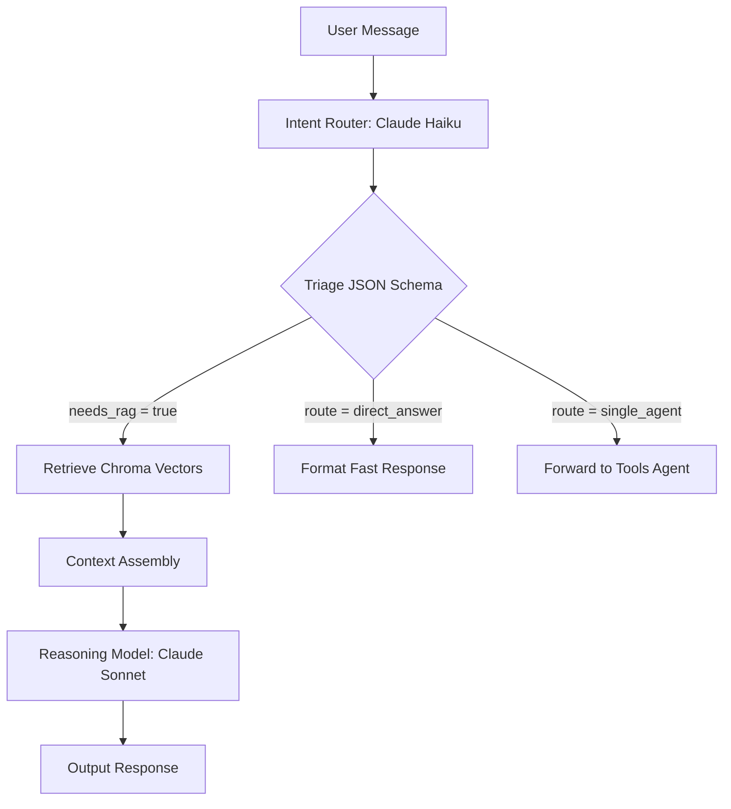

# Chief of Staff Agent — Phase 1: Text Orchestration & RAG

Phase 1 establishes the text-only orchestration core. It utilizes a dual-model triage layout to minimize latency and costs, combined with a Retrieval-Augmented Generation (RAG) vector search layer over local documents.

---

## 1. Technical Stack
- **Programming Language**: Python 3.12
- **Framework**: FastAPI (ASGI server)
- **AI Models**: 
  - **Triage Router**: Anthropic Claude Haiku (cost-efficient, high-speed JSON output)
  - **Reasoning/Response Model**: Anthropic Claude Sonnet (high-reasoning capacity)
- **Vector Database**: Chroma DB (local persistent storage)
- **Embeddings Model**: Chroma's bundled SentenceTransformers (`all-MiniLM-L6-v2` for local, zero-setup vector scoring)

---

## 2. Intent Routing & Triage Pipeline

To optimize cost and latency, every user input is first triaged by a fast model (Claude Haiku) to output a structured routing contract. This decision contract is returned in a standardized JSON schema.



### Structured Triage Router Contract
The Intent Router outputs the following structured contract:
```json
{
  "intent": "search_knowledge" | "greet" | "search_web" | "manage_calendar" | "check_weather" | "general_chat",
  "is_reflex": true | false,
  "reflex_response": "friendly greeting string or empty",
  "route": "direct_answer" | "single_agent",
  "needs_rag": true | false,
  "reasoning": "triage decision reasoning string"
}
```

---

## 3. RAG Context Retrieval Flow
1. **Ingestion**: Local text files (e.g., `preferences.txt`, `schedule.txt`) are scanned by [ingest_docs.py](file:///d:/Voice-Agent-Personal/Chief_of_agents/scripts/ingest_docs.py).
2. **Chunking**: Chunks are split using structured character boundary windowing and stored in Chroma DB.
3. **Retrieval**: When `needs_rag` is `true`, the query is embedded and evaluated against Chroma using cosine distance.
4. **Context Injection**: The top 3 retrieved text segments are compiled and formatted inside the system prompt before calling Claude Sonnet.

---

## 4. Performance & Verification Evals
For senior portfolio credibility, Phase 1 includes a validation test set of 50-100 realistic queries under [eval_dataset.json](file:///d:/Voice-Agent-Personal/Chief_of_agents/tests/eval_dataset.json).
- **Execution Script**: [run_evals.py](file:///d:/Voice-Agent-Personal/Chief_of_agents/scripts/run_evals.py)
- **Metrics Logged**:
  - Retrieval Precision @ K
  - Routing Contract accuracy
  - Token input/output count
  - Response wall-clock latency (ms)
- **Evals Log Output**: Stored in `tests/eval_report.json`.
