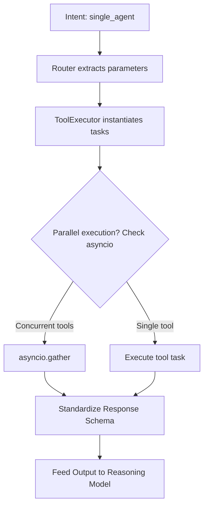

# Chief of Staff Agent — Phase 2: Agents & Tool-Calling

Phase 2 builds tool-calling capabilities. Instead of falling back to direct responses, the router can delegate complex actions to specialized tools using a parallel execution dispatcher.

---

## 1. Technical Stack
- **Programming Language**: Python 3.12
- **Agent Models**: Claude Sonnet & Claude Haiku (via Anthropic API)
- **APIs Integrated**:
  - **Weather**: Open-Meteo REST API (HTTP Client)
  - **Search**: DuckDuckGo HTML scraper (using request parsing)
  - **Calendar**: Custom local JSON database mimicking SQLite calendar interactions

---

## 2. Tool Architecture & Dispatcher Pipeline
The system utilizes a central **`ToolExecutor`** class to discover, validate, and execute tools. The execution pipeline is as follows:



---

## 3. Tool Specifications & Implementations

### A. Weather API (`get_live_weather`)
- **Action**: Resolves location coordinates and fetches current temperatures, wind speeds, and metrics.
- **Parameters**: `location` (string)

### B. Web Search (`search_web`)
- **Action**: Queries search indices for real-time web results and returns short descriptions.
- **Parameters**: `query` (string)

### C. Calendar Manager (`get_calendar_events` / `add_calendar_event`)
- **Action**: Resolves booking checks or returns schedule details.
- **Parameters**:
  - `title` (string)
  - `date_time` (string)
  - `duration_minutes` (integer)

---

## 4. Unified Tool Contract
To prevent inconsistent outputs, all tools are wrapped in a standard JSON response envelope structure:
```json
{
  "status": "success" | "error",
  "data": {
    "result_keys": "data values"
  },
  "metadata": {
    "execution_time_ms": 14.5,
    "timestamp": "2026-07-16 19:12:00"
  },
  "error": "Error details if status is error, else null"
}
```
This guarantees that the reasoning model always parses identical structures across all features.
