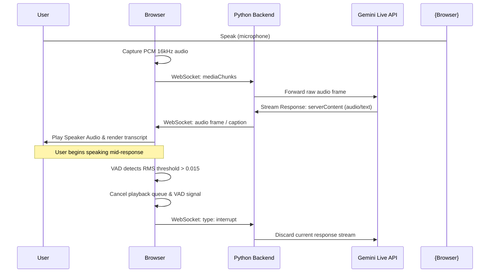

# Chief of Staff Agent — Phase 4: Voice & WebGL Visualizer

Phase 4 introduces voice capabilities using the Gemini Multimodal Live API, post-processing bloom WebGL shaders, client-side VAD, and responsive layout spacing algorithms.

---

## 1. Technical Stack
- **Backend API**: Google Gemini Multimodal Live API (v1beta WebSockets)
- **Model**: `models/gemini-2.5-flash-native-audio-latest`
- **Audio Codec**: PCM 16-bit Mono (Input: 16kHz, Output: 24kHz)
- **Frontend Libraries**:
  - **Three.js**: GPU-accelerated particle system and post-processing.
  - **Three.js EffectComposer & UnrealBloomPass**: Dynamic post-processing glows.
  - **Web Audio API**: Microphone input sampling, audio playback queuing, and frequency analysis.
- **Client Styling**: Vanilla CSS (glassmorphism tokens)

---

## 2. Bidirectional Streaming & Interruption (Barge-in) Pipeline

The voice stream handles real-time speech and client barge-in natively.



---

## 3. Voice Agent Pipeline Workflow

Here is a step-by-step technical analysis of how voice data traverses the system:

### Step 1: Audio Input & Downsampling (Client Side)
1. The browser requests microphone permissions using `navigator.mediaDevices.getUserMedia`.
2. An `AudioContext` captures the microphone stream via `MediaStreamAudioSourceNode`.
3. An audio processing worker downsamples the raw input audio stream (often 44.1kHz or 48kHz stereo) to **16kHz Mono 16-bit PCM format** (required by the Gemini API).
4. The raw binary floats are packed into Base64 strings.
5. Chunks are transmitted to the FastAPI backend over a client WebSocket connection as:
   `{ "type": "audio", "data": "base64_pcm_chunk" }`

### Step 2: Backend Proxy Bridge (Server Side)
1. The FastAPI router [main.py](file:///d:/Voice-Agent-Personal/Chief_of_agents/app/main.py) receives client frames at `/ws/live` and passes the socket connection to **`async_run_gemini_live_bridge`** in [gemini_client.py](file:///d:/Voice-Agent-Personal/Chief_of_agents/app/orchestrator/gemini_client.py).
2. The proxy initiates a secure WebSocket connection directly with the Google Gemini Multimodal Live API endpoint:
   `wss://generativelanguage.googleapis.com/ws/google.ai.generativelanguage.v1beta.GenerativeService.BidiGenerateContent`
3. Two asynchronous loops run concurrently using `asyncio.gather`:
   - **`forward_client_to_gemini`**: Converts generic incoming client websocket payloads into Gemini's native `realtimeInput` schemas and forwards them:
     ```json
     {
       "realtimeInput": {
         "mediaChunks": [
           { "mimeType": "audio/pcm", "data": "base64_pcm_chunk" }
         ]
       }
     }
     ```
   - **`forward_gemini_to_client`**: Parses streamed JSON response frames from Gemini.

### Step 3: Stream Response & Audio Queue Scheduling (Client Side)
1. The Gemini API streams synthesis response frames back over the WebSocket.
2. The proxy routes these chunks back to the client:
   - **Text / Captions**: Sent as `"type": "caption"` to append to the Live Transcript.
   - **Audio Inline Data**: Synthesized agent voice data (24kHz PCM) is forwarded as `{ "type": "audio", "data": "base64_response_chunk" }`.
3. In the browser, the base64 string is decoded into floating-point PCM audio buffers.
4. An absolute scheduler tracks **`nextStartTime`** and queues the buffers to play back-to-back using `AudioBufferSourceNode` connections. This prevents audio gaps, pops, or stutters.

### Step 4: Voice Activity Detection (VAD) & Barge-In Interruption
1. While the agent speaks, the browser analyzes the user's microphone amplitude.
2. An inline volume tracker computes the Root Mean Square (RMS) of incoming microphone float arrays.
3. If the RMS exceeds `0.015` (meaning the user has started speaking over the assistant):
   - The browser instantly **stops all pending audio nodes** in the playback queue.
   - Resets `nextStartTime` to the current `audioContext.currentTime` + `0.05s`.
   - Transmits a `{ "type": "interrupt" }` packet to the FastAPI server.
4. The Python proxy receives the interrupt flag and immediately stops sending the current turn's cached audio packets. It toggles `session.is_interrupted = True` until Gemini sends the next `turnComplete` signal, discarding in-flight frames to ensure zero barge-in latency.

---

## 4. WebGL Particle Orb Visualizer
The 3D WebGL particle system deforms dynamically based on speech frequencies:
- **Unified AnalyserNode**: Feeds the frequency array into a uniform (`u_frequency`) inside the custom shaders.
- **Morphing State Machine**:
  - `idle`: Deep blue / violet indigo profile.
  - `listening`: Emerald green / cyan profile.
  - `speaking`: Rose pink / purple magenta profile.
  - `thinking`: Deep violet / amber gold profile.
- **Post-processing**: Composites a bright neon glow over the morphed particle points.

---

## 5. Glassmorphic Card Workspace Layout
- **Dynamic Compact scaling**: Cards automatically transition to compact mode (`250x160` with text ellipses) starting at `count >= 2` active cards.
- **Free Floating**: Active cards bob gently using a GPU-accelerated coordinate formula `style.transform = translate(bobX, bobY)` at 60fps.
- **Multi-Column Stack**: Fallback cards stack vertically with `cardHeight + 20px` spacing, automatically wrapping into a new column shifted to the left by `cardWidth + 20px` to prevent card overlaps.
- **Solid border glow highlight**: The most recently created card is highlighted with a distinct cobalt background and solid neon cyan border (`#00e5ff`) until a new card is generated.
- **Absolute Close Button Flow**: The close icon (`✖`) is nested inside the status badge flexbox row, keeping it centered and aligned side-by-side without card overflows.
- **Input Relocation**: The command input and audio readout bar are integrated inside the left sidebar panel below the live transcript.
